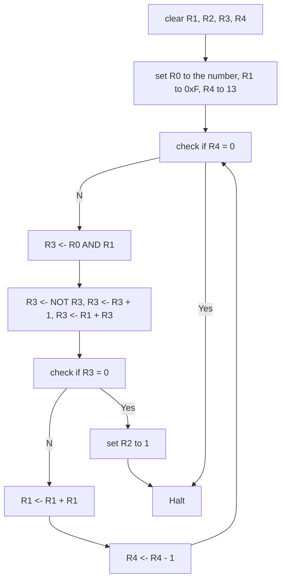

# lab1 report

3200102888 米博宇

## Algorithm explanation

### flow chart



- load the number from M[0x3100] to R0
- let R1 = 15(4 consecutive 1s) and R4 = 13(the counter)
- loop 13 times, for each loop, let R3 = R0 AND R1(bitwise), and check if R3 is equal to R1. If R3 is equal to R1, there must be 4 consecutive 1s, then let R2 be 1 and jump out of the loop, else the value of R1 shifts 1-bit to the left and continue to loop.

## Essential parts of code

#### clear registers

Assign the value of R AND 0 to R. For example:

```
0101 001 001 1 00000    ; clear R1, R1 = R1 AND 0
```

#### control the time of loops

Assign the time of loops to R4, after each loop, R4 decreases by 1. At the beginning of each loop, check if R4 is 0. If R4 is zero, then terminate the loop.

#### check if 2 registers have the same value

To check if R1's value is equal to R3's, frist change R3 to -R3 by flipping all bits of R3 and add 1 to it, then let R3 = R3 + R1. If R3 = 0, then R1 = R3, 4 consecutive 1s are found.

```
1001 011 011 1 11111    ; R3 <- NOT(R3)
0001 011 011 1 00001    ; R3 <- NOT(R3) + 1 = -R3
0001 011 011 0 00 001   ; R3 <- R1 + R3
0001 011 011 1 00000    ; R3 <- R3 + 0
0000 101 111110110      ; R3 is not 0, continue
```

## Questions

> The detail of this algorithm?

- first set R1 to be 0xF and R4 to be 13, which has 4 consecutive 1s.
- let R3 = R0 AND R1, if R3 = R1, there are 4 consecutive 1s at the last 4 bits of R0, just jump out and set R2 = 1.
- if R3 is not equal to R1, there are not 4 consecutive 1s at the last 4 bits of R0, then shift R1 1bit to the left by R1 <- R1 + R1 and continue the loop.
- the shift can be done at most 13 times, so after each loop, R4 <- R4 - 1. When a loop begins, if R4 = 0, there are 4 consecutive 1s in R0, just stop the program.