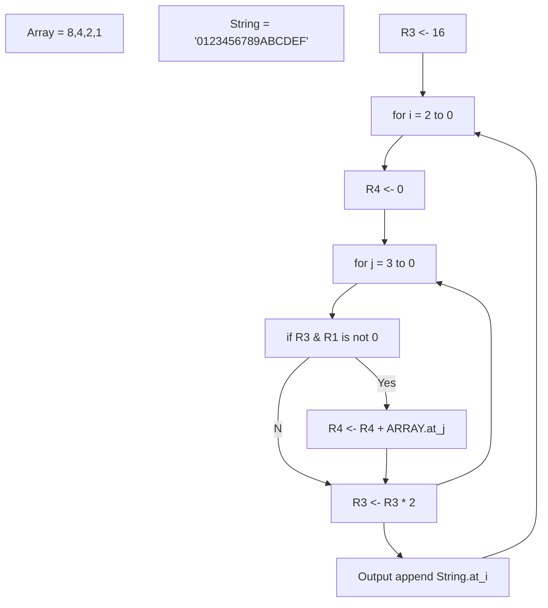

## lab2 report

3200102888 米博宇

### algorithm explanation

- read the number into R1: repeating input a character `c` , if it is not '\n', let R1 = R1 * 10 + `c` - '0', else terminate the loop. 
- transform the number to a hexadecimal string: 
  - the 0th character of output is `String.at(R1 AND 15)`
  - other  characters:

### Questions

> The data path of instruction STI?

1. Fetch stage. PC is sent to MAR, the instruction in MEMORY[PC] is sent to MDR, and then transfered to IR register through the BUS.
2. IR[8:0] is sign-extended to 16 bits, and added by PC. The result comes into the bus through the MARMUX and sent to MAR register.
3. IR[11:9] comes to SR1 and read the value of the register into SR1OUT. By some control signal, the output of ALU is SR1OUT.
4. Read the data of address MAR from MEMORY. The value of MDR comes into the BUS and the value of MAR is assigned to it.
5.  GatesALU is open, SR1OUT comes into the BUS, and MDR is assigned to SR1OUT.
6. The R, W signal is W, LD.MDR is enabled so MEMORY[MAR] is asssigned to the value of MDR.