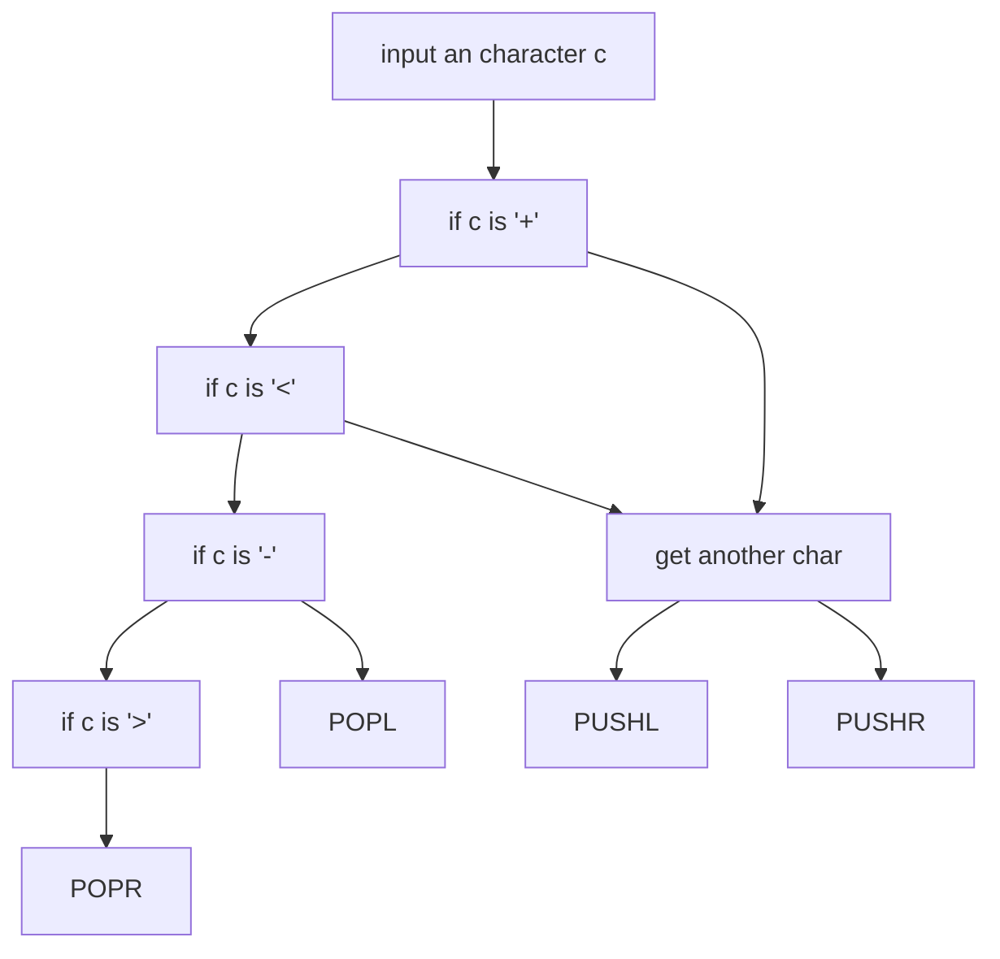

## lab03

### algorithm

#### initialization

Maintain 2 pointers to implement the stack. One of them is the address of the leftmost element, and the other is rightmost's . The left pointer is initialized to `x4001`, the right pointer is initialized to `x4000`.  Another `x1000` blocks of memory is reserved to store the output sequence.

#### push operation

When an element is to push from the left, the left pointer decreases by 1 and store the element into the memory location it points to, when an element is to push from the right, the right pointer increases by 1 and store the element into the memory location it points to.

#### pop operation

First check if the stack is empty by checking if `left pointer = righter pointer + 1`. If it is empty, append a `_` to the output sequence.

If it is not empty, when an element is to pop from the left, load the element from he memory location left pointer points to and the it increases by 1. When an element is to pop from the right, load the element from he memory location right pointer points to and the it decreases by 1.

### the flow chart



### essential part of code

#### push to the right

```assembly
PUSHR   GETC ; get the operand
        OUT	 ; echo 
        ADD R2, R2, #1 ; increment the right pointer
        STR R0, R2, #0 ; save the element
```

#### pop from the left

```assembly
POPL    NOT R0, R1
        ADD R0, R0, #2
        ADD R0, R0, R2
        BRz EMPTY ; if R1 = R2 + 1, the stack is empty
        LDR R0, R1, #0 ; load the element to be poped
        STR R0, R4, #0 ; append it to the output sequence
        ADD R1, R1, #1 ; increment the left pointer
        ADD R4, R4, #1
```

### check the opcode

```assembly
LOOP    GETC
        ADD R0, R0, #-10
        BRz DONE
        ADD R0, R0, #10
        OUT
        ; check if R0 + '+' = 0
        LD R3, PLUS
        NOT R3, R3
        ADD R3, R3, #1
        ADD R3, R0, R3
        BRz PUSHL
		; check if R0 + '<' = 0
        LD R3, LT
        NOT R3, R3
        ADD R3, R3, #1
        ADD R3, R0, R3
        BRz PUSHR
        ; check if R0 + '-' = 0
        NOT R3, R3
        ADD R3, R3, #1
        ADD R3, R0, R3
        BRz POPL
        ; check if R0 + '>' = 0
        LD R3, GT
        NOT R3, R3
        ADD R3, R3, #1
        ADD R3, R0, R3
        BRz POPR
```


### problems

The data path of the instruction `LDR`?

- Answered correctly.


