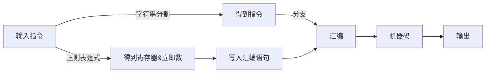

## hw3

### 设计思路

1. 利用字符串分割得到指令名称，使用分支语句找到对应的处理语句。
2. 使用正则表达式提取寄存器名称、立即数或参数的表达式或值。
3. 根据指令和寄存器编号汇编，以十六进制格式输出。

### 所实现的指令

lui lw lwx lh lhx  lhu sw swx sh shx  add addi sub slt slti sltu sltiu andi ori xori and or nor sll sllv srl srlv sra srav add beq

bne j jr begzal jal jalr ir syscall mul div li bgt

### 使用方法

1. 执行python文件
2. 逐行输入汇编指令
3. 输出8位16进制机器码
4. 输入“#”退出程序

### 程序框图




### 样例测试

```python
lui $s0, 124
0x3c10007c
lui $s0, 2*62
0x3c10007c
SLTi $t5, $s7, -1
0x29b7ffff
LW $a0, -2($s0)
0x8e04fffe
BEQ $gp, $s0, 3
0x13900001
BGEZAL $t4, 89
0x0591002b
SYSCALL
0x0000000c
```

```python
ADD $s1, $s2, $s3
0x02329820
```

```python
jal 12345
0x0c00181c
```


