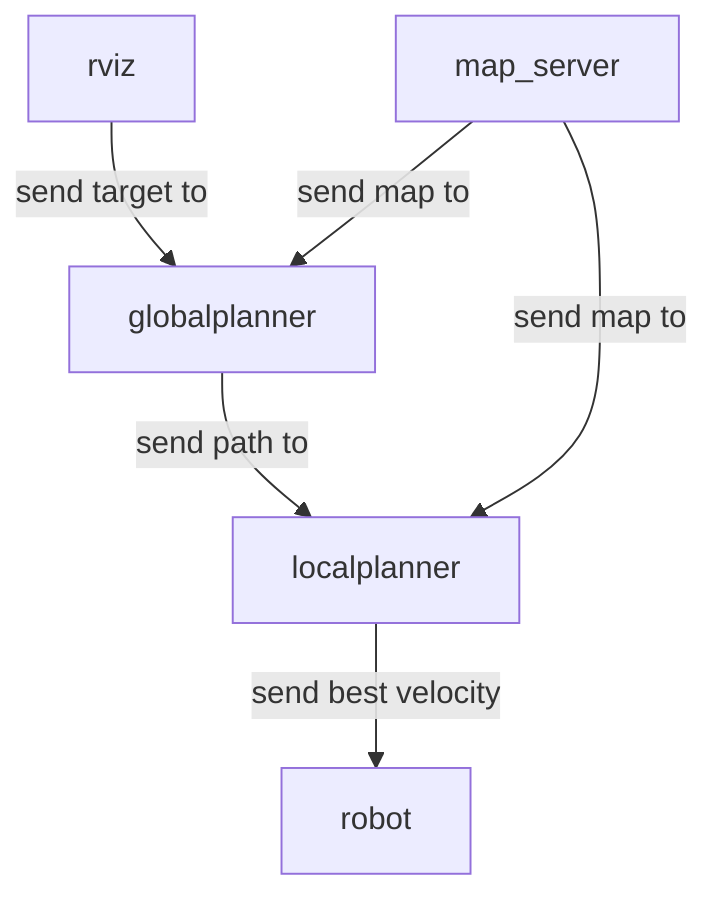

## 实验三 实物导航规划 实验报告

### 实验内容

本次实验内容为连接机器人，熟悉实物机器人的相关操作并将前八周编写并经过仿真验证的路径规划与速度规划算法应用到实物机器人上，实现设定目标点后可自动寻路、避障到达目标点的效果。

具体实验步骤如下：

1. 连接机器人：修改笔记本的IP地址，网络层面上连接机器人后修改机器人和笔记本的`etc\host`文件以及笔记本的`~/.bashrc`文件，最后在笔记本上查看机器人的topic，结果输出了topic信息，表明连接成功。
2. 建图&定位：在机器人上标定IMU，并转发激光雷达的数据，而后打开urg节点和tf转发工具。之后打开`cartographer_occupancy_grid_node`节点并在网站内遥控机器人扫描地图并保存，最后启动`map_server`向笔记本发送地图。

​                                                  

1. 修改仿真程序并允许：将原有的Global Planner和Local Planner程序中部分节点名称进行修改，而后在网站上对机器人完成手动定位，最后在笔记本上roslaunch`nav_real.launch`文件，在RVIZ中选定目标点，成功生成路径后机器人按该路径向目标移动，到达终点后停止。

​                                                  

### 程序框架和流程分析

执行roslaunch命令后，ros启动rviz界面，显示当前机器人位置和地图信息，手动设置目标点后，规划开始。

首先系统执行globalplanner函数，使用RRT算法规划出一条由起点到目标点的路径，之后调用localplanner，使用DWA算法为机器人实时规划出最优的速度。程序运行的大致框架如下图所示。

各节点间关系如下图。

### 对DWA参数的分析

**动态窗口法(DWA, Dynamic Window Algorithm)**：在速度空间中搜索适当的平移速度和旋转速度指令 (v,w)

1. 基于速度控制运动模型，构建可行的速度空间
   $V_{a}=\left\{(v, \omega)\left|v \leq \sqrt{2 \cdot \operatorname{dist}(v, \omega) \cdot \dot{v}_{b}}\right| \omega \leq \sqrt{2 \cdot \operatorname{dist}(v, \omega) \cdot \dot{\omega}_{b}}\right\}$

2. 考虑到机器人在运动过程中最大加速度的约束，在当前速度配置处以固定的小时间间隔开一个速度窗口空间
   $V_{d}=\left\{(v, \omega) \mid v \in\left[v_{l}, v_{h}\right] \wedge \omega \in\left[\omega_{l}, \omega_{h}\right]\right\}$

3. 结合机器人速度约束，获得可行速度空间
   $V_{r}=V_{a} \cap V_{d} \cap V_{s}$,    $V_{s}=\left\{(v, \omega) \mid v \in\left[-v_{\max }, v_{\max }\right] \wedge \omega \in\left[-\omega_{\max }, \omega_{\max }\right]\right\}$

4. 在可行速度空间中选择最优的速度控制指令
   DWA算法的代价函数为：

$$
\begin{aligned}
&\text { evaluation }(v, \omega)=\alpha \cdot \operatorname{heading}(v, \omega)+\beta \cdot \operatorname{dist}(v, \omega)+\gamma \cdot \operatorname{velocity}(v, \omega) \\
&\qquad \alpha+\beta+\gamma=1(\alpha \geq 0, \beta \geq 0, \gamma \geq 0)
\end{aligned}
$$
heading $(v, \omega)$ 朝向目标点 : 保证机器人朝目标点运动
$\operatorname{dist}(v, \omega)$ 远离障碍物 : 保证机器人避开障碍物, 安全不碰撞

$\operatorname{velocity}(v, \omega)$ 速度最大化 : 保证机器人以最大速度运动

在带入数据之前，我们还要对他们进行归一化处理：

$$
\begin{aligned}
\text { normal-head }(i) &=\frac{\text { head }(i)}{\sum_{i=1}^{n} \text { head }(i)} \\
\text { normal-dist }(i) &=\frac{\operatorname{dist}(i)}{\sum_{i=1}^{n} \operatorname{dist}(i)} \\
\text { normal-volocity }(i) &=\frac{\text { velocity }(i)}{\sum_{i=1}^{n} \text { velocity }(i)}
\end{aligned}
$$

仿真步长：**有可能**可以分析仿真步长多——更精确——但时间久，发送速度的时间间隔长——难控制，但是公式描述有点难，可以贴实验结果。

### 其他算法的定量分析

RRT算法定量分析

一、距离与规划时间

用RRT算法规划不同距离情况下所用时间：

| 距离   | 10    | 12    | 18    | 22    | 26    | 27    | 29    | 39    | 42    |
| ------ | ----- | ----- | ----- | ----- | ----- | ----- | ----- | ----- | ----- |
| 时间/s | 0.002 | 2.861 | 0.396 | 0.010 | 0.327 | 0.040 | 0.109 | 0.006 | 0.532 |
| 53     | 54    | 58    | 63    | 65    | 67    | 69    | 71    | 79    | 83    |
| 0.095  | 0.334 | 2.703 | 0.704 | 1.059 | 3.369 | 0.990 | 0.903 | 4.576 | 0.233 |
| 84     | 85    | 86    | 87    | 88    | 93    | 94    | 95    | 96    | 97    |
| 0.289  | 0.082 | 5.597 | 0.546 | 1.260 | 0.200 | 0.142 | 0.600 | 1.003 | 3.031 |
| 98     | 101   | 102   | 102   | 105   | 107   |       |       |       |       |
| 0.311  | 2.933 | 0.678 | 0.775 | 3.196 | 6.099 |       |       |       |       |

结果如下图所示：

从图中可以看出随着距离的增大，需要的规划时间总体在增加，在单步步长为总地图百分之一时，总体呈线形关系。同时，由于该算法的随机性，规划时间受随机因素影响较大，难以保证时长落在某一较小的区间上，下面将进一步分析该算法的随机特性。

 

二、算法的随机性分析

距离72时所用时间：

| 用时(s) | 0.045924 | 0.056718 | 0.133208 | 0.480975 | 0.088555 | 0.649683 |
| ------- | -------- | -------- | -------- | -------- | -------- | -------- |
|         | 0.014999 | 1.027701 | 0.102657 | 0.051044 | 5.765907 | 0.035089 |

最小值：0.015 最大值：5.766 平均值：0.704372 标准差：1.555826

距离73时所用时间：

| 用时(s) | 0.132412 | 0.122145 | 2.550008 | 0.240083 | 0.040937 | 0.055949 | 0.399136 | 0.020987 |
| ------- | -------- | -------- | -------- | -------- | -------- | -------- | -------- | -------- |
|         | 2.501491 | 0.259415 | 0.044775 | 0.597218 | 0.807898 | 0.053477 | 0.676402 | 0.023433 |

最小值：0.023 最大值：2.550 平均值：0.532860443 标准差：0.791012111

可以看出RRT算法是较为不稳定的算法，最小值到最大值的差距较大，且标准差的值甚至可以超过其平均值。同样的路程下有可能会在某几次突然需要较长时间才能得出结果，因此需要对其优化以得到较好的性能。